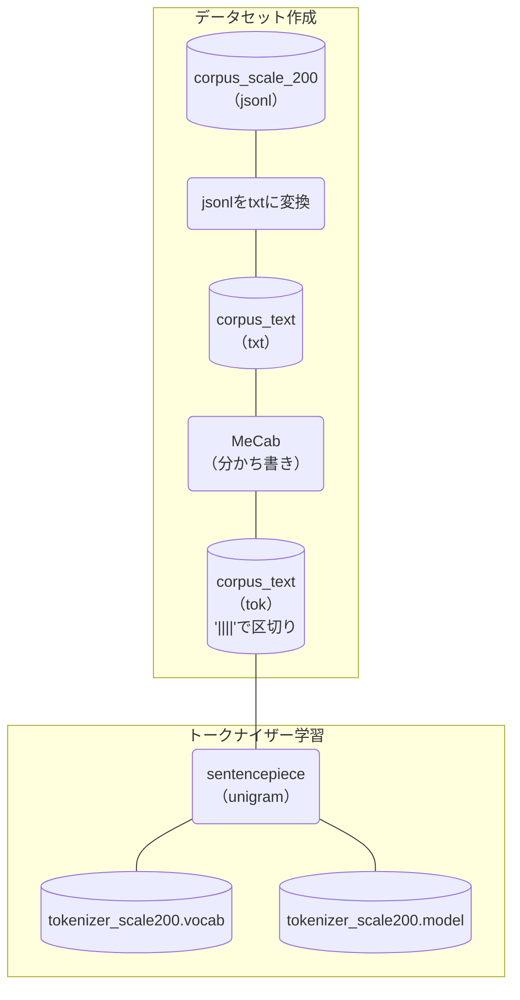

### Tanuki_tokenizer学習パイプライン



### ディレクトリ構成

https://github.com/team-hatakeyama-phase2/Tanuki_tokenizer

```bash
Tanuki_tokenizer
|
|-- learning_tokenizer
     |
     |-- config # 設定ファイルの置き場
     |    |
     |    |-- config.yaml # トークナイザー学習(sentencepiece)に使う設定ファイル
     |    |
     |    |-- special_token_list.py # 特別な意味を持つトークンの定義
     |
     |-- learning_corpus # トークナイザー学習に使うファイルの置き場
     |
     |-- preprocess_data # 作業用のファイルが置かれるディレクトリ
     |
     |-- train_sentencepiece_tokenizer_mecab.ipynb # トークナイザー学習コード

```

## 実行環境

Google Colab（ハイメモリ）

（ただし、この設定では、1GB程度のデータセットしか処理できません。）


## 追加でインストールが必要なライブラリ

- mecab
- libmecab-dev
- mecab-ipadic-utf8

## Tokenizer作成手順書

### データの準備
(Tanuki Tokenizerは非公開となっています。) 
より多くの語彙を網羅したコーパスを使用するとよいでしょう。

llm-jpでの[「Tokenizer学習用データの作成方法」](https://github.com/llm-jp/llm-jp-tokenizer/blob/main/data/training/howToCreateData.md)などが参考になります。

### jsonlをtxtに変換（コーパスがjsonlである場合）
sentencepieceでの学習の場合、txtファイルを使用することになるので、事前に変換しておきます。

### わかちがき
言語間の単語区切りを統一するため、MeCabで日本語を形態素で分割し、'||||'という滅多にでないであろう文字で分割しています。
MeCabとsentencepieceの作者の投稿[Sentencepiece の分割を MeCab っぽくする](https://qiita.com/taku910/items/fbaeab4684665952d5a9)が参考になります。
1行が非常に長いデータがあるため -bオプションを使用して、入力バッファを多めに取っておくとよいでしょう。 
>
> -b, --input-buffer-size=INT  
> set input buffer size (default BUF_SIZE)  
> 
(MeCabのリファレンスより)

### トークナイザー学習
トークナイザー学習には、sentencepieceを用いています。
主な設定は以下のとおりです。
```python
# config.yamlで設定
vocab_size: 65000
character_coverage: 0.9995
model_type: unigram
# コード中の設定
split_digits=True
allow_whitespace_only_pieces=True
remove_extra_whitespaces=False
pretokenization_delimiter="||||"
```
---
以下執筆中