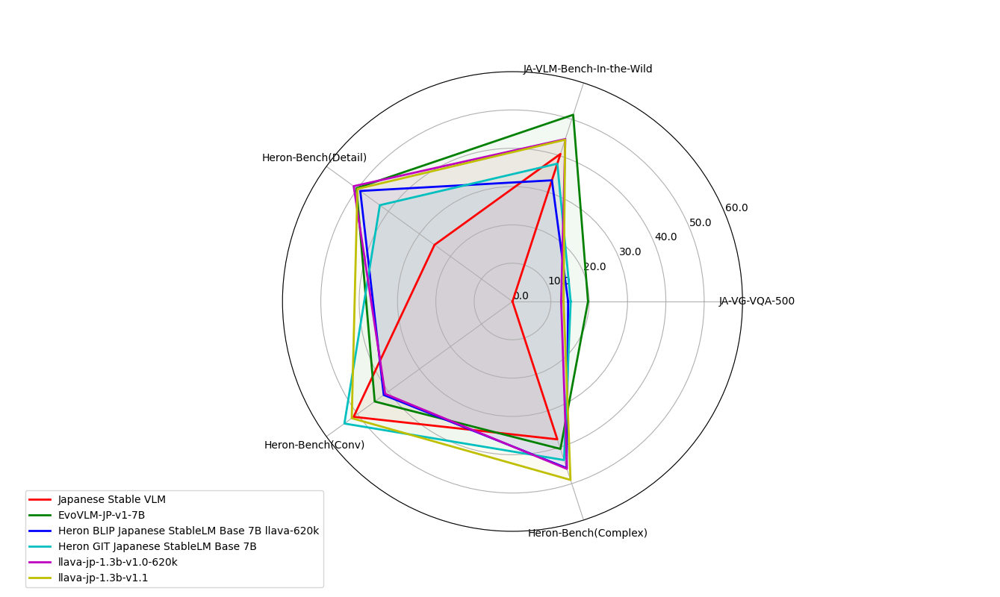
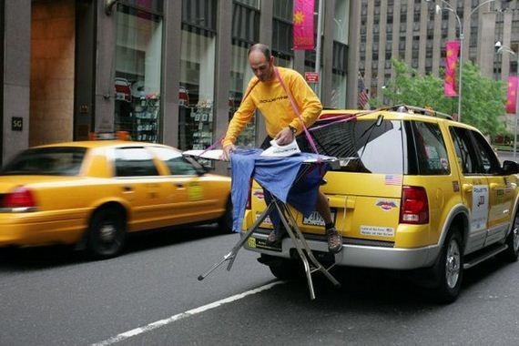

# リポジトリについて
[LLaVA-JP](https://github.com/tosiyuki/LLaVA-JP)に変更を加えたリポジトリです。tosiyuki様に感謝します。  
主な変更点は以下のとおりです。  
- データ準備用スクリプト追加
- wandbとの連携
- docker関連ファイルの追加
- データ読み込みの周りの調整

# 使い方
## インストール
```
git clone https://github.com/hibikaze-git/LLaVA-JP.git
```

## 環境構築
### docker
- docker-compose.ymlのenvironmentとdevice_idsを環境に合わせて変更し、以下を実行
- WANDB_API_KEYは必須
```
docker compose build
docker compose up -d
docker compose exec ubuntu-cuda bash
```

### docker以外
- ./docker/Dockerfileを参照して環境構築
- wandb loginしておく必要があります

## データの準備
以下で指定しているjson・画像が保存されているディレクトリを準備する必要があります。
```
configs/dataset/v1_stage_1.json
configs/dataset/v4_stage_2.json
```

### v1_stage_1
stair
```
bash prepare_datasets/v0.sh
```
cc300k
```
python tools/commoncatalog_300k
```
commoncatalog-cc-by-sa-ja
```
tools/commoncatalog-cc-by-sa-ja/README.md参照
```

### v4_stage_2
ja-vg-vqa
```
v1_stage_1のstairと一緒に準備される
```
commoncatalog-cc-by-sa-ja_detail  
commoncatalog-cc-by-sa-ja_predict
```
v1_stage_1のcommoncatalog-cc-by-sa-jaと一緒に準備される
```
commoncatalog-cc-by-ext
```
bash prepare_datasets/commoncatalog-cc-by-ext.sh
```
anime-with-caption-cc0
```
bash prepare_datasets/anime-with-caption-cc0.sh
```
commoncatalog-cc-by-sa-ja-complex
```
tools/commoncatalog-cc-by-sa-ja-complex/README.md参照
```
list_items_one_by_one_ja_detailed
```
tools/list_items_one_by_one_ja/README.md参照
```
commoncatalog-cc-by-recap-diverse_questions
```
python tools/commoncatalog-cc-by-recap-diverse_questions/download_images.py
bash prepare_datasets/commoncatalog-cc-by-recap-diverse_questions.sh
```
wit_base
```
tools/wit_base/README.md参照
```
ner-wikipedia-dataset  
wikipedia-22-12-ja-embeddings
```
bash prepare_datasets/Synthetic-TextWebImages.sh
```
TextOCR
```
bash prepare_datasets/TextOCR.sh
```

## 学習
### Stage1(事前学習)
Tanuki-8B
```
bash scripts/pretrain/pretrain_accelerate.sh \
    ./configs/train/pretrain/base.json \
    ./configs/image_encoder/siglip-so400m-patch14-384.json \
    ./configs/dataset/v1_stage_1.json \
    ./configs/model/tanuki-8b.json \
    ./output_llava/checkpoints/pretrain-llava-jp-Tanuki-8B-vision-v1 \
    llava-jp-stage1 \
    Tanuki-8B-vision-v1
```

Tanuki-8x8B
```
bash scripts/pretrain/pretrain_deepspeed_zero3_multinode.sh \
    ./configs/train/pretrain/base_tanuki_moe.json \
    ./configs/image_encoder/siglip-so400m-patch14-384.json \
    ./configs/dataset/v1_stage_1.json \
    ./configs/model/tanuki-moe.json \
    ./output_llava/checkpoints/pretrain-llava-jp-Tanuki-moe-vision-zero3-multinode \
    llava-jp-stage1 \
    Tanuki-moe-vision-zero3-multinode
```

### Stage2(ファインチューニング)
Tanuki-8B
```
bash scripts/finetune/finetune_accelerate.sh \
    ./configs/train/finetune/batch_128.json \
    ./configs/image_encoder/siglip-so400m-patch14-384.json \
    ./configs/dataset/v4_stage_2.json \
    ./configs/model/tanuki-8b.json \
    ./output_llava/checkpoints/finetune-llava-jp-Tanuki-8B-vision-v4 \
    llava-jp-stage2 \
    Tanuki-8B-vision-v4 \
    ./output_llava/checkpoints/pretrain-llava-jp-Tanuki-8B-vision-v1/mm_projector.bin
```

Tanuki-8x8B
```
bash scripts/finetune/finetune_deepspeed_zero3_multinode.sh \
    ./configs/train/finetune/base_tanuki_moe.json \
    ./configs/image_encoder/siglip-so400m-patch14-384.json \
    ./configs/dataset/v4_stage_2.json \
    ./configs/model/tanuki-moe.json \
    ./output_llava/checkpoints/finetune-llava-jp-Tanuki-moe-vision-zero3-multinode \
    llava-jp-stage2 \
    Tanuki-moe-vision-zero3-multinode \
    ./output_llava/checkpoints/pretrain-llava-jp-Tanuki-moe-vision-zero3-multinode/mm_projector.bin
```

### モデルのHFへのアップロード
- HuggingFaceにモデル用のリポジトリを新規作成したあと、以下を実行
```
python upload_model.py ./path/to/local/folder your-username/your-repo-id
```

## モデルの使い方
Tanuki-8B
```
以下をgoogle colabで実行
demo_llava_gradio.ipynb

ローカルの場合は以下も使用可能
python demo_llava_gradio.py
```

## Contributors
- [Osakana7777777](https://github.com/Osakana7777777)
- [hibikaze-git](https://github.com/hibikaze-git)

<br/>

<br/>

以下、LLaVA-JPのREADME原文です。
# LLaVA-JP
LLaVAの手法を使用して[llm-jp/llm-jp-1.3b-v1.0](https://huggingface.co/llm-jp/llm-jp-1.3b-v1.0)のような軽量なLLMをベースに画像に対応したマルチモーダルなLVLMを学習させるためのコードです。

LLaVA-JPの学習はRTX4090(24GB)一台で行われています。

[English document](docs/EN_README.md) is here.

## Release
- [4/20] v1.1を公開: scaling_on_scalesを使用して768x768の高解像度画像を入力可能にしました。また、事前学習データをLLaVA-Pretrain-JA、ファインチューニングデータをLLaVA-v1.5-Instruct-620K-JAに変更しました。モデルは[llava-jp-1.3b-v1.1](https://huggingface.co/toshi456/llava-jp-1.3b-v1.1)で公開しています。
- [2/13] [llava-jp-1.3b-v1.0-siglip-so400m-patch14-384](https://huggingface.co/toshi456/llava-jp-1.3b-v1.0-siglip-so400m-patch14-384)を公開: Image Encoderに[google/siglip-so400m-patch14-384](google/siglip-so400m-patch14-384)を使用してLLaVA-1.5の手法で学習させています。

## Models
### Full Trained
|Model|Size|Train Data|Ver|
|-|-|-|-|
|[llava-jp-1.3b-v1.1](https://huggingface.co/toshi456/llava-jp-1.3b-v1.1)|1.86B|[LLaVA-Pretrain-JA](https://huggingface.co/datasets/turing-motors/LLaVA-Pretrain-JA), [LLaVA-v1.5-Instruct-620K-JA](https://huggingface.co/datasets/turing-motors/LLaVA-v1.5-Instruct-620K-JA)|v1.1|
|[llava-jp-1.3b-v1.0-620k](https://huggingface.co/toshi456/llava-jp-1.3b-v1.0)|1.86B|[LLaVA-Pretrain-JA](https://huggingface.co/datasets/turing-motors/LLaVA-Pretrain-JA), [LLaVA-v1.5-Instruct-620K-JA](https://huggingface.co/datasets/turing-motors/LLaVA-v1.5-Instruct-620K-JA)|v1.0|
|[llava-jp-1.3b-v1.0](https://huggingface.co/toshi456/llava-jp-1.3b-v1.0)|1.73B|[STAIR Captions](https://github.com/STAIR-Lab-CIT/STAIR-captions), [LLaVA-CC3M-Pretrain-595K-JA](https://huggingface.co/datasets/toshi456/LLaVA-CC3M-Pretrain-595K-JA), [Japanese Visual Genome VQA dataset](https://github.com/yahoojapan/ja-vg-vqa), [LLaVA-Instruct-150K-JA](https://huggingface.co/datasets/turing-motors/LLaVA-Instruct-150K-JA)|v1.0|
|[llava-jp-1.3b-v1.0-siglip-so400m-patch14-384](https://huggingface.co/toshi456/llava-jp-1.3b-v1.0-siglip-so400m-patch14-384)|1.86B|[STAIR Captions](https://github.com/STAIR-Lab-CIT/STAIR-captions), [LLaVA-CC3M-Pretrain-595K-JA](https://huggingface.co/datasets/toshi456/LLaVA-CC3M-Pretrain-595K-JA), [Japanese Visual Genome VQA dataset](https://github.com/yahoojapan/ja-vg-vqa), [LLaVA-Instruct-150K-JA](https://huggingface.co/datasets/turing-motors/LLaVA-Instruct-150K-JA)|v1.0|

### Pretrained
|Model|Train Data|Ver|
|-|-|-|
|[llava-jp-1.3b-v1.1-pretrain](https://huggingface.co/toshi456/llava-jp-1.3b-v1.1-pretrain)|[LLaVA-Pretrain-JA](https://huggingface.co/datasets/turing-motors/LLaVA-Pretrain-JA)|v1.1|
|[llava-pretrain-jp-1.3b-v1.0](https://huggingface.co/toshi456/llava-pretrain-jp-1.3b-v1.0)|[STAIR Captions](https://github.com/STAIR-Lab-CIT/STAIR-captions), [LLaVA-CC3M-Pretrain-595K-JA](https://huggingface.co/datasets/toshi456/LLaVA-CC3M-Pretrain-595K-JA)|v1.0|

### Comparing VLMs
|Model|JA-VG-VQA-500<br>(ROUGE-L)|JA-VLM-Bench-In-the-Wild<br>(ROUGE-L)|Heron-Bench(Detail)|Heron-Bench(Conv)|Heron-Bench(Complex)|Heron-Bench(Average)|
|-|-|-|-|-|-|-|
|[Japanese Stable VLM](https://huggingface.co/stabilityai/japanese-stable-vlm)|-|40.50|25.15|51.23|37.84|38.07|
|[EvoVLM-JP-v1-7B](https://huggingface.co/SakanaAI/EvoVLM-JP-v1-7B)|**19.70**|**51.25**|50.31|44.42|40.47|45.07|
|[Heron BLIP Japanese StableLM Base 7B llava-620k](https://huggingface.co/turing-motors/heron-chat-blip-ja-stablelm-base-7b-v1-llava-620k)|14.51|33.26|49.09|41.51|45.72|45.44|
|[Heron GIT Japanese StableLM Base 7B](https://huggingface.co/turing-motors/heron-chat-git-ja-stablelm-base-7b-v1)|15.18|37.82|42.77|**54.20**|43.53|46.83|
|[llava-jp-1.3b-v1.0-620k](https://huggingface.co/toshi456/llava-jp-1.3b-v1.0-620k)|12.69|44.58|**51.21**|41.05|45.95|44.84|
|[llava-jp-1.3b-v1.1](https://huggingface.co/toshi456/llava-jp-1.3b-v1.1)|13.33|44.40|50.00|51.83|**48.98**|**50.39**|



## 出力例
### 例1 猫の隣には何がありますか？


| モデル名| 出力 |
|:-----------|:------------|
|[llava-jp-1.3b-v1.1](https://huggingface.co/toshi456/llava-jp-1.3b-v1.1)| 猫の隣にはノートパソコンがあります。|
|[llava-jp-1.3b-v1.0-620k](https://huggingface.co/toshi456/llava-jp-1.3b-v1.0-620k)| 猫の隣にはノートパソコンがあります。|
|[turing-motors/heron-chat-blip-ja-stablelm-base-7b-v0](https://huggingface.co/turing-motors/heron-chat-blip-ja-stablelm-base-7b-v0)|猫はノートパソコンの上に座っている。|
|[stabilityai/japanese-stable-vlm](https://huggingface.co/stabilityai/japanese-stable-vlm)|ノートパソコン|


### 例2 この画像の面白い点を教えてください？


| モデル名| 出力 |
|:-----------|:------------|
|[llava-jp-1.3b-v1.1](https://huggingface.co/toshi456/llava-jp-1.3b-v1.1)| この画像の面白い点は、黄色いタクシーの荷台に置かれた、服を脱いだままの洗濯機の上に立つ男性です。この男性は、おそらく洗濯物を乾燥させるために、この型破りな場所にいるようです。このシーンは、日常生活の中で型破りな場所に身を置くことの意外性と面白さを強調しています。|
|[llava-jp-1.3b-v1.0-620k](https://huggingface.co/toshi456/llava-jp-1.3b-v1.0-620k)| この画像の興味深い点は、黄色い車の荷台に置かれた洗濯機の上に立つ男性です。この珍しい配置は、洗濯機の上に立つ男性の姿を見ることができるため、興味深く、型破りなものとなっています。この男性は、洗濯機の上に立つことで、洗濯機の機能を妨げることなく、洗濯機の上に立っているように見えるのです。|
|[turing-motors/heron-chat-blip-ja-stablelm-base-7b-v0](https://huggingface.co/turing-motors/heron-chat-blip-ja-stablelm-base-7b-v0)|画像では、黄色いトラックの荷台で洗濯物を干している男性が描かれている。彼はトラックに寄りかかり、洗濯物を取り込んでいる。このシーンは、男性がトラックで仕事をしているか、トラックを運転していることを示唆している。トラックは、このシーンの中心的な焦点であり、男性の作業スペースを提供しているように見える。背景には、道路を走る複数の車が見え、おそらくこの地域で交通渋滞が発生している可能性がある。|
|[stabilityai/japanese-stable-vlm](https://huggingface.co/stabilityai/japanese-stable-vlm)|男は車の上で洗濯をしている|


## 学習手順
```
git clone https://github.com/tosiyuki/LLava-JP.git
```
### Stage1(事前学習)
```
bash scripts/pretrain/pretrain_llm_jp_1.3b_v1.1.sh
```

### Stage2(ファインチューニング)
```
bash scripts/finetune/finetune_llm-jp-1.3b-v1.1.sh
```

### Stage2(LoRAチューニング)
```
bash scripts/finetune/finetune_lora_llm_jp.sh
```

## Acknowledgement
- [LLaVA](https://github.com/haotian-liu/LLaVA): LLaVA-JPを学習させるに当たりほとんどのコードがこの素晴らしいプロジェクトがベースとなっています。
- [llm-jp](https://github.com/llm-jp): llm-jpが大規模なモデルだけではなく1.3Bという小規模で高性能なベースモデルを開発しているおかげでLLaVA-JPの学習は成功しています
- [scaling_on_scales](https://github.com/bfshi/scaling_on_scales/tree/master): 高解像度画像入力の対応はscaling_on_scalesの簡潔かつ分かりやすいコードのおかげで行えています。
